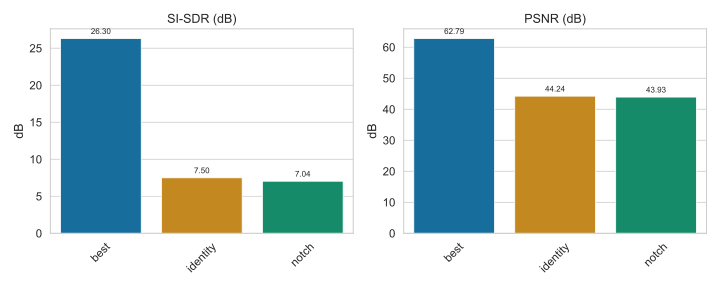
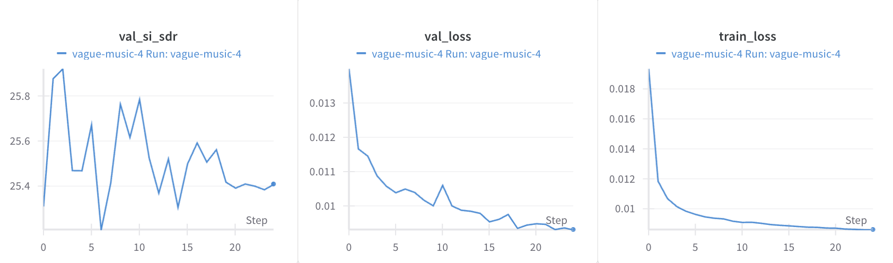

# Audio Denoising – 60 Hz Hum-Removal

> code, results and an interactive demo for **Spectrogram U-Net** that suppresses mains hum in speech recordings.

---

##   Project overview

This repo trains a **U-Net that predicts a soft mask over magnitude spectrograms** and removes the hum while preserving the insturment sound

*   Input: single-channel 16 kHz WAV
*   Output: denoised WAV (same length)
*   Training target: SI-SDR ↑  /  PSNR ↑

<p align="center">
  
</p>

---

##  Dataset

<table>
<tr><th>Split</th><th>Files</th><th>Duration</th></tr>
<tr><td>train</td><td>2 621</td><td>≈ 72 h</td></tr>
<tr><td>val</td><td>562</td><td>≈ 15 h</td></tr>
<tr><td>test</td><td>188</td><td>≈ 5 h</td></tr>
</table>

Each example contains:

1. Clean speech excerpt (from <a href="https://drive.google.com/drive/folders/1u_-hzRJ7_BKvrrpwh4wH9J4q9AcB0Uey?usp=sharing">Neo Scholars Take Home Google Drive</a>)
2. Synthetic 60 Hz + harmonics + random phase + slowly-varying amplitude
3. Weighted mix at SNR ∈ {0, 5, 10, 15} dB

Scripts live in `dataset/`:
```bash
# Download speech, synthesise hum, build CSV metadata
python dataset/build_dataset.py --root dataset
```

---

##  Model architecture

Spectrogram U-Net (<a href="https://arxiv.org/abs/1810.11520">Oh, J., Kim, D., & Yun, S.-Y. (2018)</a>) operating on STFT magnitudes (513 bins):
````text
                            +------+               +------+
       │ mag │              | up 4 |<--skip--+-----| out  |
  x ──▶│(B,1)│──inc──down1──| ...  |        |     +------+
       +------+             +------+        |
                         ···                        sigmoid→ soft mask ∈ [0,1]
````
* Base channels = 32 (≈ 1.7 M params)
* Bilinear up-sampling, **sigmoid** on logits → mask
* Estimate complex STFT:  mask × noisy STFT, then iSTFT

Hyper-parameters (see `train_spectrogram_unet.py`):

| argument | value | note |
|----------|-------|------|
| `--epochs` | 50 | cosine LR decay |
| `--lr` | 3 × 10⁻⁴ | AdamW |
| `--batch` | 16 | 1-s crops (44 100 samples) |
| Loss | 0.7 · L1(spec) + 0.3 · L1(time) |
| Aug. | random crops, amplitude normalisation |

---

##  Results

[](https://wandb.ai/lpgomez-stanford-university/audio-denoise-demo/reports/60-Hz-Hum-Removal-with-Spectrogram-U-Net--VmlldzoxMzcyOTQzNQ)

*Training vs. validation loss and SI-SDR stay closely aligned, indicating the model converges without over-fitting.*

````csv
method,split,si_sdr [dB],psnr [dB]
identity,test,7.50,44.24
notch,test,7.04,43.93
unet (best.pt),test,26.30,62.79
````

* +18.8 dB SI-SDR over raw noisy input ⇒ **~75× noise power reduction**
* Fixed notch filter barely helps because speech energy also sits at 60 Hz and harmonics.

Generate CSV & figures:
```bash
python scripts/evaluate_models.py \
  --dataset dataset --split test --checkpoint checkpoints/best.pt \
  --out results/results.csv
python scripts/plot_results.py results/results.csv
```

### 🔊 Listen

| noisy | denoised |
|-------|----------|
| [sax – noisy 🎧](samples/saxophone/saxophone_E3_15_fortissimo_normal_noisy_snr10.0dB.wav) | [sax – denoised 🎧](samples/saxophone/denoised_saxophone.wav) |

---

##  Quickstart

```bash
# create env (conda or venv) and install deps
pip install -r requirements.txt

#  Train (≈ 5 h on one RTX 3060, CPU works but slower)
python train_spectrogram_unet.py --dataset dataset --epochs 50 --batch 16

#   Evaluate best checkpoint
python scripts/evaluate_models.py --dataset dataset --split test \
       --checkpoint checkpoints/best.pt --out results/results.csv
```

---

#  Local Gradio app

```bash
python scripts/denoise_demo.py
```
Then open <http://127.0.0.1:7860> and drag-&-drop a WAV.


---

##   Reproducibility

1. Set random seeds in `train_spectrogram_unet.py` (disabled by default).
2. All checkpoints, CSVs and figures are version-controlled – see `checkpoints/best.pt`.

## References

* Oh, J., Kim, D., & Yun, S.-Y. (2018). *Spectrogram-channels U-Net: A source separation model viewing each channel as the spectrogram of each source*. arXiv preprint [arXiv:1810.11520](https://arxiv.org/abs/1810.11520).

* Zhang, Y., & Li, J. (2023). *BirdSoundsDenoising: Deep Visual Audio Denoising for Bird Sounds*. Proceedings of the IEEE/CVF Winter Conference on Applications of Computer Vision (WACV), 3164–3173.

* Babaev, N., Tamogashev, K., Saginbaev, A., Shchekotov, I., Bae, H., Sung, H., Lee, W., Cho, H.-Y., & Andreev, P. (2024). *FINALLY: Fast and Universal Speech Enhancement with Studio-like Quality*. Advances in Neural Information Processing Systems (NeurIPS).

* Zhang, Y., & Li, J. (2023). *Complex Image Generation SwinTransformer Network for Audio Denoising*. Proceedings of INTERSPEECH 2023, Dublin, Ireland.

---

Made with ❤️ & PyTorch 2.7 ✨ 

