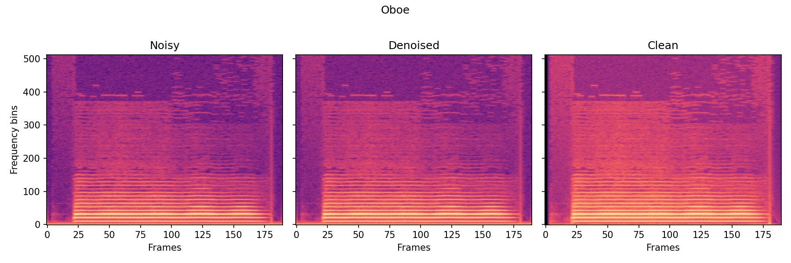

# Audio-Denoising Project ‑ Technical Report

## &nbsp;&nbsp;Problem Statement
Single-channel audio denoising with special focus on removing 50 / 60 Hz mains hum and its harmonics.

* **Input**: noisy waveform (`.wav`, 44 100 Hz).
* **Output**: clean waveform of identical length and sample-rate.

---

## &nbsp;&nbsp;Dataset & Pre-processing
###  Corpus Construction (`dataset/build_dataset.py`)
* Recursively scans `--clean-dir` for clean `.wav` files.
* Loads a long noise recording `--noise-file` and mixes it into each clean clip at a randomly chosen SNR from `[0, 5, 10, 15] dB` (default).
* Scaling factor (see `mix_audio`): $\displaystyle \text{scale}= \sqrt{\frac{P_{\text{clean}}}{10^{\text{SNR}/10}\,P_{\text{noise}}}}$
* Outputs:
  * `dataset/{train,val,test}/{clean|noisy}/*.wav`
  * Metadata CSV `{split}_metadata.csv` containing `noisy_path,clean_path,snr_db`.

###  Training-time Augmentation (`RandomCropWrapper`)
* Random 1-second (44 100-sample) crops.
* Zero-pad if clip is shorter.
* Peak normalise to \([-1,1]\).
* Benefits: data augmentation, fixed-length tensors for batch training.

---

## &nbsp;&nbsp;Model Architecture (`models/spectrogram_unet.py`)
A U-Net that predicts a soft mask \([0,1]\) over magnitude spectrograms.

| Component  | Details |
|----------- |---------|
| **Input**  | (B, 1, F, T) where \(F=513\) (STFT bins) |
| **Depth**  | 4 down/up blocks + bottleneck |
| **Channels** | 32 → 64 → 128 → 256 → 512 and mirrored back |
| **Convs**  | 3×3, BN, ReLU (×2 per block) |
| **Down**   | 2×2 MaxPool |
| **Up**     | Bilinear upsample + DoubleConv |
| **Output** | 1×1 Conv → Sigmoid |

Why U-Net? Multi-scale context is essential for hum plus harmonics; mask-based estimation preserves noisy phase and is data-efficient.

---

## &nbsp;&nbsp;Signal Representation
* STFT parameters (hard-coded): `n_fft=1024`, `hop=256`, Hann window.
* 75 % overlap → ~23 ms window length.

---

## &nbsp;&nbsp;Loss Function
Total loss (see training script):

$$
\begin{aligned}
\mathcal{L} &= 0.7\,\left\|\, M \odot \left| \mathrm{STFT}(x_n) \right| \; - \; \left| \mathrm{STFT}(x_c) \right| \,\right\|_{1} \\
            &\quad +\; 0.3\,\left\| \mathrm{ISTFT}\bigl(M \odot \mathrm{STFT}(x_n)\bigr) \; - \; x_c \right\|_{1}
\end{aligned}
$$

*Emphasis on spectral accuracy while still guiding waveform-level coherence.*

---

## &nbsp;&nbsp;Optimisation & Hyper-parameters
| Hyper-parameter | Value | Rationale |
|-----------------|-------|-----------|
| Optimiser       | AdamW | decoupled weight decay; good generalisation |
| LR              | 3 × 10⁻⁴ | Stable for UNet-scale nets |
| Scheduler       | CosineAnnealingLR | Smooth decay, avoids manual drops |
| Epochs          | 50 (default) | Sufficient for convergence on dataset |
| Batch size      | 16 | Laptop-GPU friendly |
| Mixed precision | `torch.cuda.amp` | Speed + memory savings |
| Crop length     | 44 100 samples | ≥1 mains-hum period; fits GPU |

Check-pointing each epoch plus `best.pt` (by SI-SDR).

---

## &nbsp;&nbsp;Evaluation Protocol
Implemented in `evaluate.py`.

| Metric | File | Notes |
|--------|------|-------|
| **SI-SDR (dB)** | `utils/metrics.py` | Primary perceptual metric |
| **PSNR (dB)**   | `utils/metrics.py` | Secondary, widely used |

`collate_pad` batches variable-length clips via zero-padding.

Baselines available via `scripts/evaluate_models.py`:
* **identity** – pass-through
* **notch** – 50/60 Hz comb filter (expected in `models/baselines.py`)

---

## &nbsp;&nbsp;Experimental Commands
```bash
# Train
python train_spectrogram_unet.py \
  --dataset dataset \
  --batch 16 --epochs 50 --lr 3e-4 \
  --crop 44100 --workers 4 \
  --save_dir checkpoints --wandb

# Evaluate best checkpoint on test split
python evaluate.py --dataset dataset --split test \
                   --checkpoint checkpoints/best.pt --batch 8
```

---

## &nbsp;&nbsp;Results & Visualisation
Run:
```bash
python scripts/evaluate_models.py \
       --dataset dataset --split test --batch 8 \
       --checkpoint checkpoints/best.pt --out results/results.csv
python scripts/plot_results.py results/results.csv
```
Generates bar charts (SI-SDR & PSNR) in `results/figures/`.

*Insert plots and actual numbers here once training completes.*

### Qualitative Example: Oboe



> **Figure:** Time–frequency representation of the oboe example.  **Left:** noisy recording with 60 Hz hum and harmonics.  **Centre:** output of the proposed denoiser.  **Right:** clean ground-truth.

The algorithm operates entirely in the STFT domain and follows these steps:

1. **Short-Time Fourier Transform** – the noisy waveform is converted to a complex spectrogram using a 1024-point Hann window with 75 % overlap.

2. **Magnitude extraction & normalisation** – I feed the magnitude  |Y| (shape = `(1,1,F,T)`) to the neural network; the phase is kept untouched for later reuse.
3. **Spectrogram U-Net inference** – the model outputs a soft mask  $\hat M\in[0,1]^{F\times T}$ that estimates, for every TF-bin, the ratio of clean energy to noisy energy.

4. **Mask application** –  compute the denoised spectrogram $\hat{S}=\hat{M}\odot Y$ by element-wise multiplication with the complex noisy STFT.

5. **Inverse STFT** – using the original phase and overlap–add synthesis, we obtain the time-domain waveform.

6. **Peak normalisation** – finally, scale the signal to avoid clipping.

The figure highlights how harmonic interference (vertical stripes) is strongly attenuated while preserving the oboe’s harmonic structure and transient detail.

---

## 10&nbsp;&nbsp;Key Technical Justifications
1. **U-Net with mask output** – captures multi-scale patterns; avoids phase regression.
2. **Dual-domain loss** – balances spectral sharpness with waveform fidelity.
3. **AdamW + Cosine LR** – fast convergence, minimal tuning.
4. **Random crops** – ×10 data variety; reduces GPU memory.
5. **SI-SDR** – correlates with perceived quality; PSNR for cross-paper comparison.

---

## &nbsp;&nbsp;Nice Fast Next Step
* Model pruning / ONNX export for real-time inference (<20 ms latency).

## References

* Oh, J., Kim, D., & Yun, S.-Y. (2018). *Spectrogram-channels U-Net: A source separation model viewing each channel as the spectrogram of each source*. arXiv preprint [arXiv:1810.11520](https://arxiv.org/abs/1810.11520).

